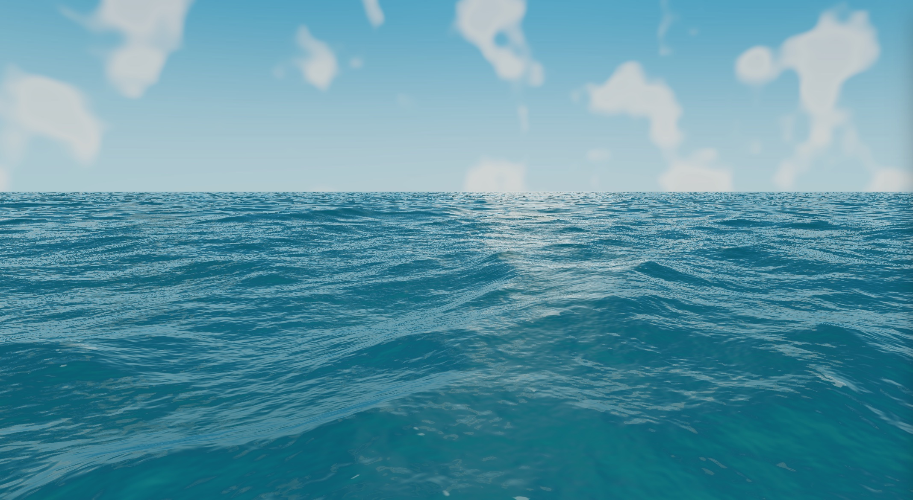

English | [简体中文](README.zh-CN.md)

# yong-webgl2-water

A **WebGL2 implementation** of Tethys water: a framework-free water rendering engine,
plus a demo page written with Vite and vanilla TypeScript.

This project is extracted from [`inkwell-webgpu-water`](https://github.com/ly05010419/inkwell-webgpu-water)
(commit `7dbf39c` / `7331e81`) and keeps **only the WebGL2 render path**: no
WebGPU engine, no Three.js WebGPU adapter layer.
The engine's math, GLSL and per-frame execution order are unchanged, line for line, so with the
same parameters it is **pixel-for-pixel identical** to the source project's `/webgl2` page
(see "Pixel-Alignment Verification").

**Live demo:** <https://yong-webgl2-water.vercel.app/> (deployed on Vercel; needs a WebGL2-capable browser)



---

## What It Renders

| Subsystem | Implementation |
| --- | --- |
| Offshore wave spectrum | Three-level JONSWAP/TMA cascade; the 128² initial spectrum is generated deterministically on the CPU and evolved every frame on the GPU |
| Inverse transform | Stockham self-sorting IFFT; the three cascade levels are packed into a single atlas and completed in 14 fragment passes |
| Nearshore hydrodynamics | Conservative shallow-water solver with Rusanov flux (water depth + flux in both directions); hydrostatic reconstruction keeps it well-balanced |
| Breaker events | A one-row, 256-wide event texture recording the position and strength of the breaker front (`BREAKER_ENABLED` is currently off) |
| Terrain | A 512² terrain field texture baked once; the shoreline and seabed profiles are generated by analytic functions |
| Water geometry | 10 clipmap rings (64² per ring, outermost 16384 m) + a 20 km horizon skirt |
| Shading | Cox-Munk microfacet BRDF, depth-aware absorption, screen-space refraction, analytic reflection, caustics and foam |
| GPGPU | Done entirely with fragment-shader ping-pong (WebGL2 has no compute shaders) |
| State management | A GL state cache layer deduplicates bindings; development builds run a consistency spot-check at the end of every frame |

Two scenes: `open` (open water, drawn straight into the default framebuffer) and `shore`
(island shore, which needs an off-screen capture of scene color and depth for the water
surface to sample when refracting). Two views: `surface` and `underwater`.

---

## Quick Start

```bash
npm install
npm run dev        # demo page (Vite dev server)
npm run build      # demo page + library (dist-demo/ and dist/)
npm run preview    # preview the built demo page
npm test           # vitest (451 cases)
npm run lint       # eslint
npm run typecheck  # tsc --noEmit
npm run check      # lint + typecheck + test + build
```

Browser requirements: **WebGL2**, plus either `EXT_color_buffer_float` or
`EXT_color_buffer_half_float` (floating-point render targets). If both are missing, an error
message (in Chinese) is shown and rendering stops.
`OES_texture_float_linear` and `EXT_disjoint_timer_query_webgl2` are optional enhancements
(the former affects linear filtering of `rgba32f`, the latter provides GPU timing metrics).

---

## Using It as a Library

```ts
import { WebGl2WaterEngine } from "yong-webgl2-water";

const canvas = document.querySelector("canvas")!;
const engine = new WebGl2WaterEngine(canvas, { scene: "open", view: "surface" });

await engine.init();          // acquire the context, compile shaders, allocate resources; rejects on failure
// …
engine.setScene("shore");     // switch at runtime
console.log(engine.getMetrics());

engine.dispose();             // stop the render loop and release every GL object
```

The engine comes with an orbit camera (drag to rotate, wheel to zoom) and a `ResizeObserver`,
so the canvas only needs a size in CSS.
DPR is capped at 1.5 (1 when `benchmark: true`), then multiplied by `renderScale`.

### Options and Their Setters

`new WebGl2WaterEngine(canvas, options)` accepts `Partial<WaterLabOptions>` and clamps it at
construction time exactly as the table below specifies, which is fully equivalent to calling the matching setter.

| Option | Type / range | Default | Setter | Notes |
| --- | --- | --- | --- | --- |
| `mode` | `"optimized" \| "reference"` | `optimized` | `setMode` | Reference mode runs two 1/120 s substeps |
| `view` | `"surface" \| "underwater"` | `surface` | `setView` | The medium the camera is in |
| `scene` | `"open" \| "shore"` | `open` | `setScene` | Switching rebuilds the nearshore field |
| `meshResolution` | 96 – 320 (integer) | 240 | `setMeshResolution` | Terrain mesh; `shore` is fixed at 512² |
| `simulationResolution` | 64 – 512 (integer) | 256 | `setSimulationResolution` | Nearshore field resolution; switching rebuilds it |
| `renderScale` | 0.5 – 1.25 | 1 | `setRenderScale` | Off-screen resolution multiplier; changing it rebuilds the frame targets |
| `waveScale` | 0.15 – 1.6 | 1 | `setWaveScale` | Wave-height multiplier |
| `distantRoughness` | 0 – 3 | 0 | `setDistantRoughness` | BRDF roughness compensation for the distant view |
| `detailRange` | 0.4 – 8 | 1 | `setDetailRange` | Fade-out distance multiplier for capillary waves and wave crests |
| `swellSmoothing` | 0 – 3 | 1 | `setSwellSmoothing` | Screen-space smoothing of distant slopes |
| `longCascadeScale` | 80 – 480 | 240 | `setLongCascadeScale` | Long-wave cascade tile size (meters) |
| `mediumCascadeScale` | 24 – 128 | 64 | `setMediumCascadeScale` | Medium-wave cascade tile size (meters) |
| `fogReach` | 0 – 3 | 0 | `setFogReach` | Radial fog distance offshore; 0 disables it |
| `fixedTime` | `number?` | — | — | Freeze simulation time, for reproducible screenshots |
| `frameLimit` | `number?` | — | — | Stop the loop after rendering N frames |
| `benchmark` | `boolean` | `false` | — | Lower the DPR cap to 1 |
| `cameraYaw` / `cameraPitch` | `number?` | — | — | Override the initial orbit angles |

The bounds table itself is exported as `WATER_LAB_OPTION_BOUNDS`, and the demo page's sliders
read it directly, so the panel can never offer a value the engine would clamp away.

### Package Exports

`WebGl2WaterEngine`, `DEFAULT_WATER_LAB_OPTIONS`, `WATER_LAB_OPTION_BOUNDS`,
`normalizeWaterLabOption`, `normalizeWaterLabOptions`, `parseWaterLabQuery`,
`WATER_PROFILES`, `TETHYS_WATER_LEVEL`, `TETHYS_WATER_FIELD_SIZE`,
`TETHYS_REFERENCE_SIMULATION_RESOLUTION`, `waterSimulationBytes`,
`waterTriangleCount`, `frameTriangleCount`, the camera orbit constants and
`resolveInitialCameraOrbit` / `clampCameraPitch`, plus types such as `WaterLabOptions`,
`WaterLabMetrics`, `WaterRenderMode`, `WaterScene`, `WaterView` and
`CameraOrbitState`. `tests/package-api.test.ts` pins this list down.

---

## Demo Page URL Parameters

`parseWaterLabQuery(location.search)` is a pure, DOM-independent function and can be tested directly in node.

| Parameter | Meaning |
| --- | --- |
| `mode` | `reference` takes the two-substep reference path; any other value means `optimized` |
| `view` | `underwater` or `surface` |
| `scene` | `shore` or `open` |
| `mesh` / `simulation` / `scale` | `meshResolution` / `simulationResolution` / `renderScale` |
| `waves` / `farRough` / `detail` / `smooth` | `waveScale` / `distantRoughness` / `detailRange` / `swellSmoothing` |
| `longScale` / `mediumScale` / `fog` | The two cascade scales and the fog distance |
| `fixedTime` | Freeze simulation time (seconds); `fixedTime=0` is valid and is not treated as absent |
| `frames` | Stop after rendering N frames; less than 1 means no limit |
| `benchmark` | `1` lowers the DPR cap to 1 |
| `yaw` / `pitch` | Initial orbit angles |
| `ui` | `0` hides the control panel (for clean screenshots) |

Every numeric parameter goes through the same clamping as the setters, so a URL and the
equivalent sequence of setter calls land on exactly the same engine state.

### Automation Bridge

The demo page installs a bridge on `window.__WEBGL2_WATER_LAB__` whose method names are
**identical** to the source project's `window.__WEBGPU_WATER_LAB__` (only the global name
differs), so the source project's Playwright scripts can be reused as-is:

```
ready, getMetrics(), resetMetrics(),
setMode, setView, setScene,
setMeshResolution, setSimulationResolution, setRenderScale,
setWaveScale, setDistantRoughness, setDetailRange, setSwellSmoothing,
setLongCascadeScale, setMediumCascadeScale, setFogReach
```

The bridge is installed as a placeholder **before** `init()` (all setters are no-ops,
`ready: false`), so even a failed startup can report its reason through `getMetrics().error`
instead of leaving the script to hang until it times out.

---

## Metrics Reference

`getMetrics()` returns a snapshot; the demo page polls it every 250 ms.

| Field | Meaning |
| --- | --- |
| `ready` | Whether the render loop has started |
| `triangles` | Triangles submitted per frame: terrain + clipmap rings (outer rings weighted by a 1.5 degeneracy factor) + breaker patches |
| `simulationBytes` | Bytes occupied by the nearshore field ping-pong pair |
| `simulationSubsteps` | 1 (optimized) or 2 (reference) |
| `sceneCapturePasses` | 1 for `shore`, 0 for `open` |
| `disturbanceCount` | Number of wake impulses injected so far |
| `frameMeanMs` / `frameP95Ms` / `frameP99Ms` / `frameMaxMs` / `fps` | Sliding-window statistics over the last 360 frames (nearest-rank percentiles) |
| `hitchFrames` | Frames in the window that exceeded 50 ms |
| `submitMeanMs` | Per-frame JS-side submission time |
| `gpuSimulationMeanMs` / `gpuRenderMeanMs` / …P95 | GPU timings; `null` without `EXT_disjoint_timer_query_webgl2` |
| `gpuTimestampSamples` | Number of sample pairs produced by both timers |
| `adapter` | `"WebGL2 · <renderer string>"`, with a note appended for software rendering |
| `error` | The first fatal error (in Chinese); the render loop stops along with it |

---

## Pixel-Alignment Verification

```bash
# start the source project's production server on http://127.0.0.1:3200 (npm run build && npm run start)
npm run build:demo
npx vite preview --port 4173 --strictPort &
node scripts/compare-with-source.mjs        # three scenes, pixelmatch threshold 0
node scripts/interaction-smoke.mjs          # bridge setters + viewport resize regression
```

`compare-with-source.mjs` captures the three scenes `open+surface`,
`shore+surface` and `open+underwater` at 1280×800 / DPR 1, with the parameters
`fixedTime=8.25&frames=240&ui=0`. It does two necessary things:

1. **Waits for the render loop to stop on its own** — it polls `getMetrics()` until two consecutive snapshots are exactly the same.
   The metrics freeze once `frames=240` is reached, and a fixed sleep cannot guarantee that.
2. **Intercepts the source project's `**/models/**` requests** — the source demo page also draws a glTF sailboat,
   whereas this project contains no hull by design. With the model download blocked, the source engine skips the hull
   (a missing asset is optional set dressing over there), so both sides render the same scene. Not a single byte of the source repository has to change.

Current result: `mismatch=0` and `maxΔ=0` across all three scenes.

---

## Directory Structure

```
src/index.ts              library entry
src/lib/webgl2-water-engine.ts   main engine class (lifecycle, per-frame order, metrics, public API)
src/lib/webgl2/           WebGL2 layer: infrastructure (gl-*) + individual passes + GLSL templates
src/lib/*.ts              GPU-agnostic CPU modules: spectrum generation, camera/uniform packing,
                          interaction, option clamping, metrics, URL parsing, shallow-water CPU reference
src/demo/                 demo page: main.ts, panel.ts, panel-model.ts, bridge.ts,
                          labels.ts, dom.ts, panel.css
tests/                    23 vitest files
scripts/                  Playwright: pixel comparison, interaction regression, doc screenshots
docs/                     porting spec, lessons learned, progress, testing notes and README screenshots
```

`src/lib/webgl2/index.ts` is a barrel file for external consumers and tests;
**internal imports are forbidden** (it creates a circular dependency that makes GLSL constants read as
`undefined` in the TDZ), and that rule is enforced by `no-restricted-imports` in
`eslint.config.mjs`.

---

## Credits and License

MIT. The original Tethys water research and Raw WebGPU implementation come from
[`inkwell-webgpu-water`](https://github.com/ly05010419/inkwell-webgpu-water)
(© James Addison, modifications © Yong Li); this repository is its WebGL2 extraction.
The specs and lessons recorded during the port are in [`docs/`](docs/), and third-party notices in
[`THIRD_PARTY_NOTICES.md`](THIRD_PARTY_NOTICES.md).
